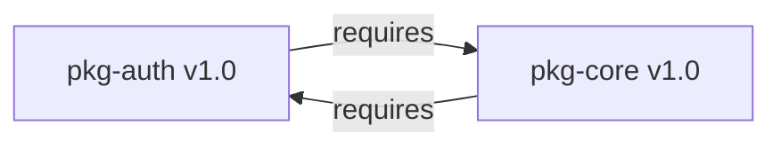

# Demo: Circular Dependency Resolution
**Project**: Superintelligence Dependency Manager (Superint)
**Date**: January 1, 2026

This demo illustrates a complex scenario where two packages depend on each other (circular dependency), requiring a simultaneous "atomic" update to avoid breaking the build.

## 1. Initial State
We have a monorepo setup with two internal packages, `pkg-auth` and `pkg-core`. They are currently at version 1.0.0. Use of `pkg-auth` 2.0.0 requires `pkg-core` 2.0.0, and vice-versa, creating a lockstep upgrade requirement.

### Dependency Graph (Cycle)


### `packages/pkg-auth/package.json`
```json
{
  "name": "@super/pkg-auth",
  "version": "1.0.0",
  "dependencies": {
    "@super/pkg-core": "1.0.0"
  }
}
```

## 2. Scan & Cycle Detection
The scanner analyzes the workspace and detects the inter-dependency.

### Command
```bash
./bin/superint-dep-manager scan --workspace ./packages
```

### Scan Output
```text
🔍 Scanning workspace: ./packages
INFO Analyzing dependency graph...
WARN ⚠️ Circular dependency detected:
     @super/pkg-auth <--> @super/pkg-core

🔄 Available Updates:
   📦 @super/pkg-auth: 1.0.0 → 2.0.0 (major)
   📦 @super/pkg-core: 1.0.0 → 2.0.0 (major)

📋 Generating update plan...
INFO Linked Versions Strategy: These packages must be updated together.
```

## 3. Atomic Group Update
The agent groups the updates into a single atomic Pull Request. Updating them individually would cause the build to fail (dependencies would be unsatisfiable during the transitional state).

### Command
```bash
./bin/superint-dep-manager update --workspace ./packages --strategy atomic
```

### Execution Output
```text
🚀 Executing Atomic Group Update
   > Grouping 2 packages into strict update set.
   
🏃 Verifying Build Consistency...
   > Attempting combined update...
   > Resolving graph for @super/pkg-auth@2.0.0 + @super/pkg-core@2.0.0... OK.

📝 Creating Pull Request...
   > Title: "chore(monorepo): Atomic update of auth and core packages to v2.0.0"
   > Description: "This PR updates circular dependencies simultaneously to maintain graph integrity."
   
🎉 PR Created: https://github.com/example/monorepo/pull/123
```

## 4. Why this matters
Without this feature, an automated tool might try to update `pkg-auth` to 2.0.0 first. The build would fail because `pkg-core@1.0.0` is incompatible with `pkg-auth@2.0.0`.

### Failed Scenario (Sequential Update)
1. Update `pkg-auth` -> 2.0.0
2. `npm install` runs.
3. **ERROR**: `pkg-core@1.0.0` requires `pkg-auth@1.x`. Version mismatch.

### Success Scenario (Atomic Update)
The `superint` agent generates a `package-lock.json` or `yarn.lock` state where *both* valid versions are present, ensuring no broken intermediate commit exists.
